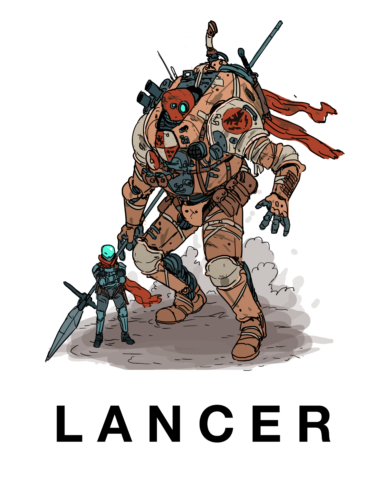

# Lancer 1.8 - Community Edition

_Welcome to the cavalry._

If you're just here for the files, you can find them [here](https://drive.google.com/file/d/1VrmnI0Uh3hilCnL91XF9MRBAeBNt3ki5/view?usp=sharing). If you'd like to learn more, read on.

## What is Lancer?

[**Lancer**](https://twitter.com/Lancer_RPG) is an indie mech RPG currently in the final stages of development, designed by [Tom Parkinson Morgan](https://twitter.com/Lancer_RPG) (better known for his webcomic [Kill Six Billion Demons](https://killsixbilliondemons.com/)) and featuring the writing of [Miguel Lopez](https://twitter.com/the_one_lopez).

It's 5014, and our arm of the galaxy is home to trillions. Blink gates dot the stars, the Omninet connects every world, and humanity answers to a single administrative power: Union. But despite its interconnectedness, the galaxy is still a dangerous place... and when all else fails, mech pilots like you are gonna be ones pulling victory from the jaws of defeat.

## What is the Community Edition?

The Community Edition has been a perennial fan project to update the official Lancer releases to the best possible versions they can be - the cutting edge state-of-the-game on any given moment.

For three editions, we've acted as the corrective arm of [the community's testing and feedback efforts](https://docs.google.com/document/d/11avjUcVQHkKYXbbPwcNj-u1SqPXkgYuzpbuZq77DByE/edit#heading=h.arx9tieu4lpc) - cleaning up typos and quick fixes, folding in official rulings and errata, and working with the devs to tweak the book's text for clarifications whenever necessary.

And now, with the release of [Lancer 1.8](https://twitter.com/Lancer_RPG/status/1080595674847096832), we're expanding our mandate once again: while earlier releases of the CE had stuck to directly editing the source PDFs to create new ones, this repo represents the culmination of community efforts to make the game as accessible as possible through porting it to a WYSIWYM format.

Not only should this make collecting and incorporating feedback easier through the use of issue trackers and pull requests, we hope to directly support other ambitious fan projects by acting as a single source of truth that can compile the game's content into machine readable formats.

## How can I help?

Join the [Lancer discord!](https://discord.gg/ABx8gcf) Not only is it the home turf for the devs, it's where you can find the #community-edition channel as well.

It's an exciting time to be a fan and get in on the action, especially as we finish the final balance and polish passes on the game to get it ready for its first true release!
